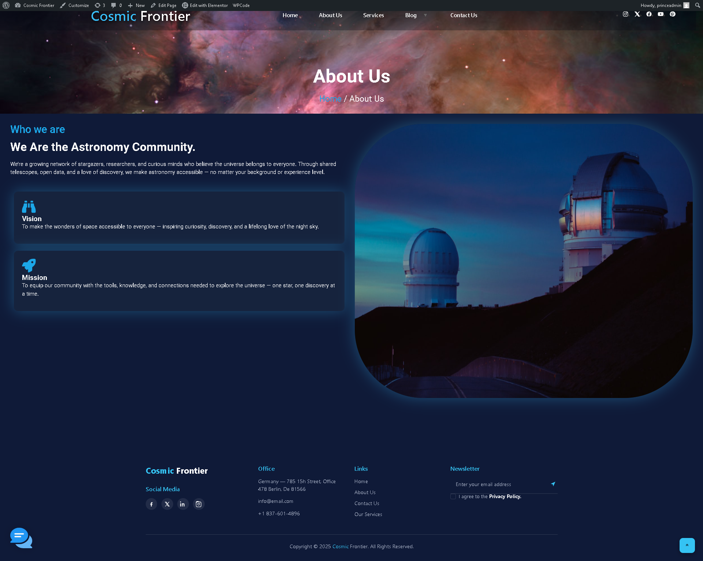
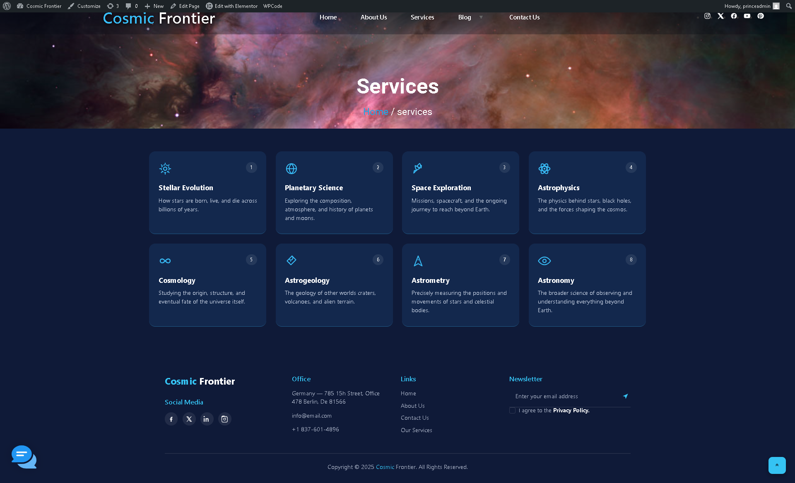
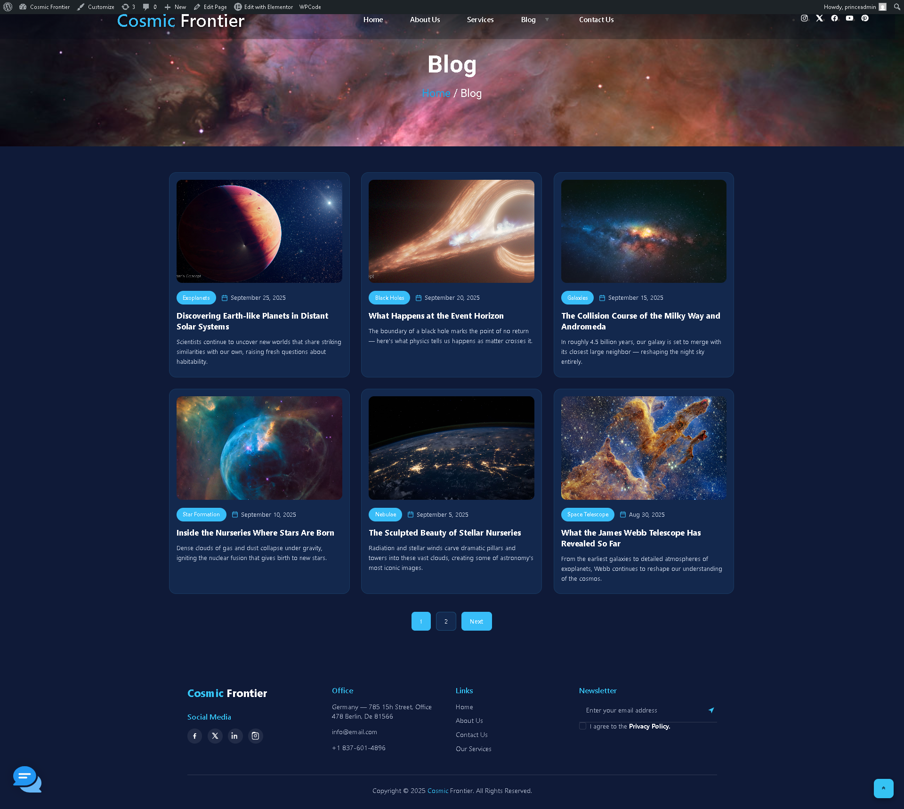
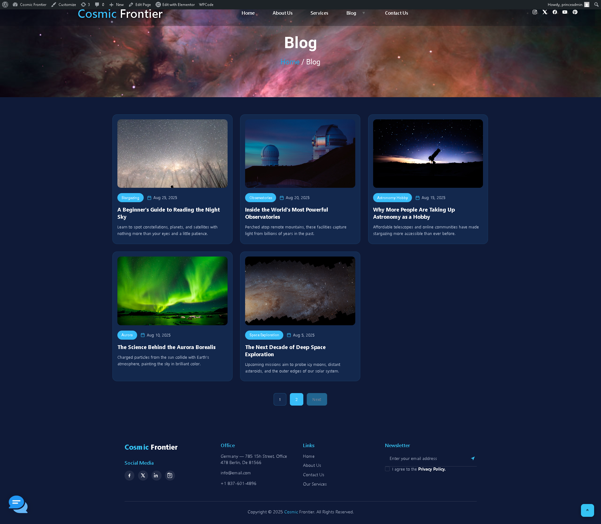
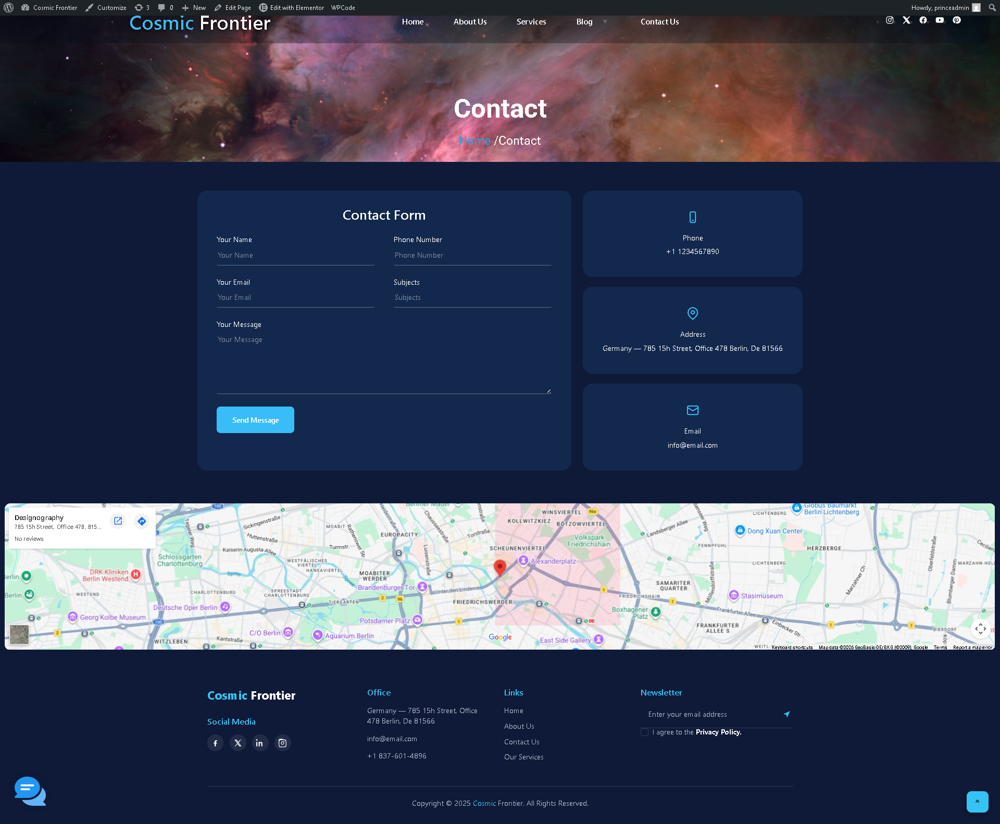

# 🌌 Cosmic Frontier

> **Exploring the Stargazing, one star at a time.**

Cosmic Frontier is a modern astronomy-themed website designed to explore the world of stargazing, space exploration, astronomy, and astrophysics.

The website was designed and developed using WordPress and Elementor, with a responsive dark-space visual theme and multiple content-focused sections.

---

## ✨ Features

- 🌌 Astronomy-themed homepage
- 🔭 Stargazing and astronomy content
- 🪐 Services covering different areas of astronomy
- 📰 Blog section with 11 astronomy-related articles
- 📄 Multi-page website structure
- 📱 Responsive user interface
- 🌙 Dark space-themed design
- 📍 Contact form and location section
- 💬 Integrated website chatbot interface
- 🧭 Navigation between major website sections

---

## 🛠️ Tech Stack

| Technology | Purpose |
|---|---|
| WordPress | Website development platform |
| Elementor | Page design and visual development |
| HTML/CSS | Website structure and styling |
| JavaScript | Interactive website functionality |

---

## 📑 Website Pages

- 🏠 Home
- ℹ️ About Us
- 🛠️ Services
- 📰 Blog
- 📞 Contact Us

### Blog

The Blog section contains **11 astronomy-related articles**, distributed across two pages.

### Services

The Services section contains **8 astronomy-focused services**, including:

- Stellar Evolution
- Planetary Science
- Space Exploration
- Astrophysics
- Cosmology
- Astrogeology
- Astrometry
- Astronomy

---

## 📸 Project Screenshots

### 🏠 Home

### ℹ️ About Us

### 🛠️ Services

### 📰 Blog — Page 1

### 📰 Blog — Page 2

### 📞 Contact Us

## 🎯 Project Purpose

Cosmic Frontier was developed as a web development project to demonstrate the creation of a complete multi-page website using WordPress and Elementor.

The project focuses on presenting astronomy-related information through a visually engaging and user-friendly interface.

---

## 👨‍💻 Author

**Prince Acharya**

B.Tech CSE Student

Interested in Web Development, AI, and Space Technology.

---

## 📜 License

This project was created for educational and portfolio purposes.

The project may be viewed and studied for learning purposes. Original design, content arrangement, and project work belong to the author.
